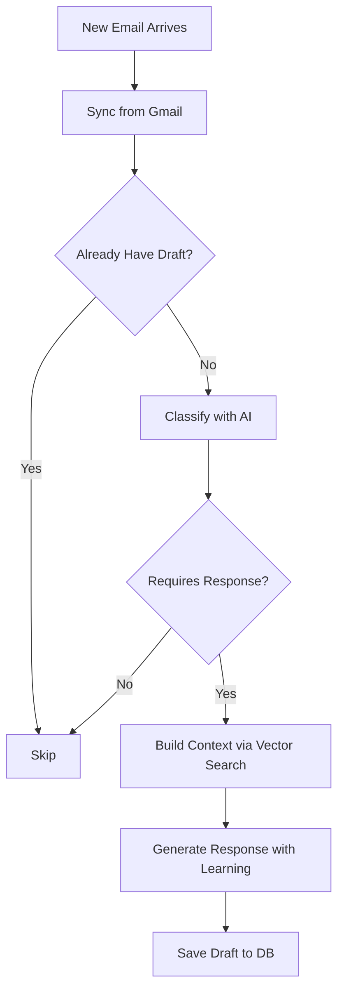

# Maia Mail - Intelligent Email Response System

**Branch:** `2025-10-19-maia-mail-main`

## Overview

Maia Mail is an intelligent email response system that automates the email workflow:

1. **Processes** new Gmail threads automatically
2. **Classifies** emails using AI (relevant/spam/requires response)
3. **Constructs** response context via vector search across all workspace databases
4. **Generates** draft responses using AI with learning from past patterns
5. **Presents** drafts in an interactive review UI with full visibility
6. **Sends** approved emails via Gmail API with proper threading

## Features

### 🤖 AI-Powered Classification
- Determines if emails pertain to the user
- Filters spam, promotions, and phishing
- Identifies which emails require responses

### 🔍 Intelligent Context Building
- Vector search across **all databases** in workspace
- Finds relevant documents automatically
- Includes full thread history

### 📚 Learning System
- Learns from successful responses (rolling index of last 20)
- Matches user's writing style and tone
- Improves over time

### 💬 Draft Chat with Artifacts
- Claude-style numbered artifacts for drafts
- Refine drafts interactively
- `/send [number]` command to send specific draft
- Multiple iterations supported

### 📊 Comprehensive Review UI
- **Progress tracking**: "8/14 threads resolved (57%)"
- Full email visibility (never need to open Gmail)
- Context view showing what sources were used
- Copy-paste friendly formatting
- Keyboard navigation

## Commands

```bash
# Review drafts (default)
maia mail

# Review drafts for specific workspace
maia mail -ws trass

# Multiple workspaces
maia mail -ws trass -ws koii

# Process new emails then review
maia mail -p -ws trass

# Just process (no review)
maia mail -p
```

## File Structure

```
promaia/
├── mail/
│   ├── __init__.py               # Module init
│   ├── draft_manager.py          # SQLite CRUD for email_drafts table
│   ├── learning_system.py        # Learn from successful responses
│   ├── classifier.py             # AI email classification
│   ├── context_builder.py        # Vector search + context construction
│   ├── response_generator.py    # AI response generation with learning
│   ├── gmail_sender.py           # Gmail API sending wrapper
│   ├── processor.py              # Main orchestration pipeline
│   ├── draft_chat.py             # Interactive chat with artifacts
│   └── review_ui.py              # prompt_toolkit review interface
├── cli/
│   └── mail_commands.py          # CLI command handlers
└── connectors/
    └── gmail_connector.py        # Modified: added send_email/send_reply

data/
├── hybrid_metadata.db            # Modified: added email_drafts table
└── mail_response_patterns/
    └── successful_responses.json # Learning index (created automatically)
```

## Database Schema

### `email_drafts` Table

```sql
CREATE TABLE email_drafts (
    id INTEGER PRIMARY KEY AUTOINCREMENT,
    draft_id TEXT UNIQUE NOT NULL,
    workspace TEXT NOT NULL,
    thread_id TEXT NOT NULL,
    message_id TEXT NOT NULL,
    
    -- Inbound message
    inbound_subject TEXT,
    inbound_from TEXT,
    inbound_snippet TEXT,
    inbound_date TEXT,
    inbound_body TEXT,
    
    -- Classification
    pertains_to_me BOOLEAN DEFAULT TRUE,
    is_spam BOOLEAN DEFAULT FALSE,
    requires_response BOOLEAN DEFAULT TRUE,
    classification_reasoning TEXT,
    
    -- Draft response
    draft_subject TEXT,
    draft_body TEXT,
    draft_body_html TEXT,
    
    -- Context
    response_context TEXT,  -- JSON
    system_prompt TEXT,
    ai_model TEXT,
    
    -- Versioning
    draft_number INTEGER DEFAULT 1,
    chat_session_id TEXT,
    previous_draft_id TEXT,
    version INTEGER DEFAULT 1,
    
    -- Status
    status TEXT DEFAULT 'pending',  -- pending/sent/skipped/archived
    created_time TEXT NOT NULL,
    reviewed_time TEXT,
    sent_time TEXT,
    
    -- Safety
    safety_string TEXT,  -- First 5 chars of subject
    
    -- Thread context
    thread_context TEXT,
    message_count INTEGER DEFAULT 1
);
```

## Workflow

### Processing Pipeline



### Review Flow

```mermaid
graph TD
    A[Launch Review UI] --> B[Show Progress 8/14]
    B --> C[List All Drafts]
    C --> D{User Action}
    D -->|Enter| E[Open Draft Chat]
    D -->|a| F[Archive - Clear from Queue]
    E --> G[Refine with AI]
    G --> H[Generate Draft #2, #3...]
    H --> I[/send to send draft]
    I --> J[Sent Successfully]
    I --> N[Save to Learning]
    N --> C
    F --> C
```

## Usage Examples

### Basic Usage

```bash
# 1. Process new emails for trass workspace
maia mail -p -ws trass

# Output:
# 📧 Processing emails for workspace: trass
# Found 5 thread(s) to process
# Processing: RE: Q4 Timeline Discussion
#   → Classification: pertains=True, spam=False, requires_response=True
#   → Found 12 relevant sources
#   → Generated 156 word response
#   ✅ Draft saved
# ...
# ✅ Generated 3 draft(s)

# 2. Review drafts
maia mail -ws trass

# Shows TUI with:
# ╭──────────────────────────────────────────────────────╮
# │  Progress: [████████░░░░] 2/5 resolved (40%)         │
# │  Status: ✅ 2 sent  •  🗄️ 0 archived  •  ⏳ 3 pending  •  ⏭️  0 skipped │
# ╰──────────────────────────────────────────────────────╯
```

### Draft Chat

```bash
# After pressing 'c' in review UI:

===== Inbound Message =====
From: john@example.com
Subject: RE: Q4 Timeline Discussion
...

╭──── Draft #1 ────────────────────────────╮
│                                          │
│ Thanks for following up. Based on our   │
│ latest sprint planning, we're on track  │
│ for Q4 launch...                         │
│                                          │
╰──────────────────────────────────────────╯

💬 Chat to refine the draft, or type a command:
   /send [number] - Send draft
   /q - Return to review queue

You: Make it more concise and add the specific date

🤔 Refining draft...

╭──── Draft #2 ────────────────────────────╮
│                                          │
│ Thanks for following up. We're on track │
│ for October 28th Q4 launch.             │
│                                          │
╰──────────────────────────────────────────╯

You: /send 2

⚠️  Ready to send Draft #2
Type the first 5 characters to confirm: RE: Q
Confirm: RE: Q

📤 Sending Draft #2...
✅ Email sent successfully!
```

## Configuration

### Gmail OAuth Scope

The Gmail connector now includes the `gmail.send` scope:

```python
SCOPES = [
    'https://www.googleapis.com/auth/gmail.readonly',
    'https://www.googleapis.com/auth/gmail.send'
]
```

**Note:** Users will need to re-authorize Gmail access to grant send permissions.

### Learning System

Patterns are automatically saved to `data/mail_response_patterns/successful_responses.json` when emails are sent.

Example pattern:
```json
{
  "inbound": {
    "from": "john@example.com",
    "subject": "RE: Q4 Timeline",
    "body_snippet": "Can you provide an update..."
  },
  "response": {
    "subject": "RE: Q4 Timeline",
    "body": "Thanks for following up. Based on...",
    "length": 156
  },
  "metadata": {
    "workspace": "trass",
    "sent_time": "2025-10-19T14:30:00Z",
    "notes": "Successfully sent via maia mail"
  },
  "timestamp": "2025-10-19T14:30:00Z",
  "id": "20251019_143000"
}
```

## Cron Setup

For automated processing every 30 minutes:

```bash
# Add to crontab
*/30 * * * * cd /path/to/promaia && ./venv/bin/python -m promaia mail -p -ws trass >> logs/mail_processor.log 2>&1
```

## Safety Features

1. **Confirmation Required**: Must type first 5 characters of subject to send
2. **Review Before Send**: All drafts go through review UI
3. **Draft Versioning**: Multiple iterations tracked
4. **Learning from Success**: Only successful sends are learned from
5. **Context Transparency**: See exactly what sources informed the draft

## Key Bindings

### Review UI

- `↑/↓` - Navigate draft list
- `Enter` - Open draft chat to review/refine
- `a` - Archive draft (clear from queue 🗄️)
- `q` - Quit

### Draft Chat

- `Enter` - Send message/command
- `Ctrl+J` - New line (Shift+Enter on many terminals)
- `/send [number]` - Send specific draft
- `/q` - Return to review queue

## AI Models Used

- **Classification**: Claude Sonnet 4 (or GPT-4o fallback)
- **Response Generation**: Claude Sonnet 4 (or GPT-4o fallback)
- **Draft Refinement**: Same as generation

Models are automatically selected based on available API keys.

## Benefits

1. **Never Miss Important Emails**: Automatic classification ensures nothing slips through
2. **Context-Aware Responses**: Vector search finds relevant information automatically
3. **Consistent Tone**: Learning system matches your writing style
4. **Time Savings**: Drafts generated in seconds instead of minutes
5. **Full Visibility**: See everything without opening Gmail
6. **Safe**: Confirmation required, review before send
7. **Improves Over Time**: Learns from each successful interaction

## Future Enhancements

Potential improvements:

- [ ] Schedule send times
- [ ] Template management
- [ ] Custom classification rules
- [ ] Email priority scoring
- [ ] Attachment handling
- [ ] HTML email support
- [ ] Multi-language support
- [ ] Team collaboration features

## Troubleshooting

### Gmail Authorization

If you get an authorization error:

```bash
maia auth configure google
```

### No Drafts Generated

Check:
1. Gmail database is synced: `maia database sync --source [workspace].gmail`
2. Recent emails exist (last 2 hours by default)
3. Emails require responses (not spam/promotions)

### Learning System Not Working

Check:
1. Directory exists: `data/mail_response_patterns/`
2. File is writable: `successful_responses.json`
3. Emails are being successfully sent (only successful sends are learned)

## Architecture Decisions

### Why Artifacts?

Claude-style numbered artifacts provide:
- Clear separation between conversation and output
- Easy reference (`/send 2`)
- Version history visibility
- Professional presentation

### Why Learning System?

Following the NL query pattern caching approach:
- Proven pattern in the codebase
- Rolling index keeps recent patterns
- Improves response quality over time
- Matches user's natural style

### Why prompt_toolkit?

- Consistent with existing CLI patterns (`workspace_browser.py`, `simple_selector.py`)
- Clean, copy-paste friendly output
- Keyboard-driven workflow
- Professional appearance

## Credits

Implementation Date: October 19, 2025
Branch: `2025-10-19-maia-mail-main`
Feature Design: Comprehensive planning session with user specifications

