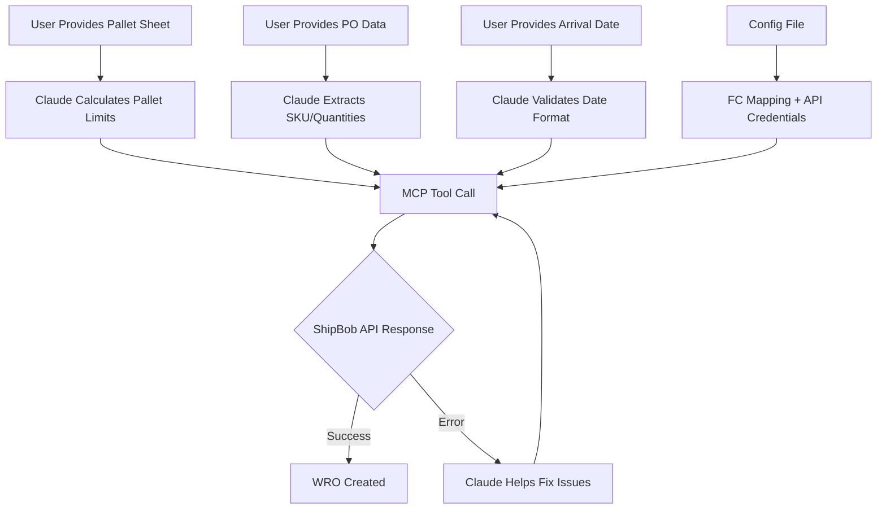

# ShipBob Warehouse Receiving Order (WRO) MCP Tool Guide

## Overview

This guide provides the design and implementation details for a Model Context Protocol (MCP) tool that creates Warehouse Receiving Orders (WROs) in ShipBob. The tool enables Claude to interactively work with users to derive pallet configurations and create properly structured WROs for multi-SKU pallet shipments.

## Required Information Sources

Before automating WRO creation, you need to gather information from multiple sources. Understanding what data comes from where is crucial for successful automation.

### From Purchase Order (PO) Documents

**Essential Data:**
- **Purchase Order Number** (e.g., "0004") - Used as unique identifier
- **Product SKUs** (e.g., "YP3-C1", "YP3-C2", "YP3-C3", "YP4")
- **Total Quantities per SKU** (e.g., 4,284 Purple, 9,180 Blue, 3,600 Peach, 17,064 Small Parts)
- **Destination Information** - Helps identify target fulfillment center

**Example from PO:**
```
Country: US
Purple: 4,284
Blue: 9,180  
Peach: 3,600
Total plush: 17,064
Small Parts Cases: 79 cases (216 items per case = 17,064 total)
```

### From Pallet Sheet/Logistics Documents

**Critical Configuration Data:**
- **Pallet Capacity Limits** (e.g., 432 units for plush, 4,320 for small parts)
- **Items per Carton** (e.g., 36 plush per carton, 216 small parts per carton)
- **Cartons per Pallet** (e.g., 12 cartons per pallet for plush, 20 for small parts)
- **Physical Dimensions** and pallet stacking rules
- **Destination Address** for fulfillment center identification

**Example from Pallet Sheet:**
```
Plushes: 48x46.7x33cm, 474 cartons, 36 items per carton
- 4 cartons per layer, 3 layers, 12 cartons per pallet
- 39 pallets × 12 = 468 cartons, 1 pallet × 6 cartons

Accessory Set: 48x46x19cm, 79 cartons, 216 items per carton  
- 4 cartons per layer, 5 layers, 20 cartons per pallet
- 3 pallets × 20 = 60 cartons, 1 pallet × 19 cartons
```

### Information Gathered Manually/Via API

**Authentication & Access:**
- **ShipBob API Key** - Personal Access Token with receiving permissions
- **Account Permissions** - Verify access to target fulfillment centers

**Dynamic Mappings (via API calls):**
- **SKU to Inventory ID mapping** - Retrieved from `/2.0/inventory` endpoint

**User-Provided Input (Required):**
- **Expected Arrival Date** - Only input needed from user/logistics team

**MCP Tool Parameters (Per Order):**
- **Pallet Limits** - Derived by Claude from pallet sheet arithmetic
- **Product Quantities** - Extracted by Claude from PO data  
- **Expected Arrival Date** - User provides with Claude's help
- **PO Number** - Extracted from purchase order

**Configuration File Settings (Static Infrastructure):**
- **API Credentials** - ShipBob API key and authentication
- **Fulfillment Center Mapping** - Key-value pairs for FC selection
- **Package Type** - `"Pallet"` (standard for current operations)
- **Tracking Number Pattern** - `{PO}-PALLET-{001-999}` (auto-generated)
  ```json
  {
    "shipbob": {
      "api_key": "...",
      "fulfillment_centers": {
        "Ontario": 156,
        "Moreno Valley": 100,
        "Commerce": 111
      },
      "default_fc": "Ontario",
      "package_type": "Pallet",
      "box_packaging_type": "MultipleSkuPerBox",
      "tracking_pattern": "{PO}-PALLET-{counter:03d}"
    }
  }
  ```

### Data Validation Matrix

| Source | Data Element | Validation Required | Example |
|--------|--------------|-------------------|---------|
| PO | SKU Names | Must match ShipBob exactly | "YP3-C1" not "YP3-C1 " |
| PO | Quantities | Must sum correctly | 17,064 = 79 cases × 216 items |
| PO | PO Number | Must be unique | Check for existing WROs |
| Pallet Sheet | Capacity Limits | Must not exceed in API | 432 max for plush pallets |
| Pallet Sheet | Total Pallets | Cross-check with calculations | 44 pallets total expected |
| API | Inventory IDs | Must be active products | `"is_active": true` |
| API | FC Permissions | Account must have access | Test with small order first |
| User Input | Arrival Date | Must be future date | ISO 8601 format required |
| Config | FC Name | Must exist in mapping | "Ontario" → 156 |
| Config | Tracking Pattern | Auto-generated format | "0004-PALLET-001" |

### Common Data Reconciliation Issues

**Quantity Mismatches:**
- PO shows "79 cases" but doesn't specify items per case
- Pallet sheet shows total cartons but PO shows total items
- **Solution**: Always convert to individual item counts for API

**SKU Variations:**
- PO uses internal SKUs, ShipBob uses different SKUs
- Case sensitivity matters ("YP3-C1" ≠ "yp3-c1")
- **Solution**: Maintain mapping table and validate via API

**Pallet Calculation Errors:**
- Pallet sheet shows theoretical vs actual capacity
- Remainder quantities don't fit evenly
- **Solution**: Use actual limits from successful shipments, not theoretical

### Claude Interactive Workflow



**Key Insight**: Claude interactively derives all dynamic parameters from user-provided documents, enabling flexible handling of varying data formats per shipment.

## MCP Tool Specification

### Tool Definition

```javascript
{
  "name": "create_shipbob_wro",
  "description": "Create a ShipBob Warehouse Receiving Order from PO and pallet data",
  "inputSchema": {
    "type": "object",
    "properties": {
      "arrival_date": {
        "type": "string",
        "description": "Expected arrival date (ISO 8601 format: YYYY-MM-DDTHH:mm:ssZ)"
      },
      "po_data": {
        "type": "object",
        "description": "SKU to quantity mapping from purchase order",
        "additionalProperties": {"type": "number"},
        "example": {"YP3-C1": 4284, "YP3-C2": 9180, "YP3-C3": 3600, "YP4": 17064}
      },
      "pallet_limits": {
        "type": "object",
        "description": "SKU to max-per-pallet mapping derived from pallet sheet arithmetic",
        "additionalProperties": {"type": "number"},
        "example": {"YP3-C1": 432, "YP3-C2": 432, "YP3-C3": 432, "YP4": 4320}
      },
      "po_number": {
        "type": "string",
        "description": "Purchase order number (must be unique in ShipBob)"
      },
      "fulfillment_center": {
        "type": "string",
        "description": "Fulfillment center name (optional, defaults to config setting)",
        "enum": ["Ontario", "Moreno Valley", "Commerce"]
      }
    },
    "required": ["arrival_date", "po_data", "pallet_limits", "po_number"]
  }
}
```

### Required API Endpoints
- `GET /2.0/inventory` - Get inventory IDs by SKU (called internally by tool)
- `GET /1.0/fulfillmentCenter` - Get available fulfillment centers (used for validation)
- `POST /2.0/receiving` - Create WRO (main operation)

## Step 1: Claude's Data Derivation Process

### 1.1 Pallet Limits Calculation

**Claude helps users calculate from pallet sheet:**
```
User: "My pallet sheet shows 12 cartons per pallet, 36 items per carton"
Claude: "That's 12 × 36 = 432 items per pallet for plush items"

User: "Small parts show 20 cartons per pallet, 216 items per carton"  
Claude: "That's 20 × 216 = 4,320 items per pallet for small parts"
```

**Result for tool:**
```javascript
pallet_limits: {
  "YP3-C1": 432,
  "YP3-C2": 432, 
  "YP3-C3": 432,
  "YP4": 4320
}
```

### 1.2 PO Data Extraction

**Claude helps parse PO documents:**
```
User: "PO shows Purple: 4,284, Blue: 9,180, Peach: 3,600, Small Parts Cases: 79"
Claude: "I see 79 cases of small parts. At 216 per case, that's 79 × 216 = 17,064 items"
```

**Result for tool:**
```javascript
po_data: {
  "YP3-C1": 4284,  // Purple
  "YP3-C2": 9180,  // Blue
  "YP3-C3": 3600,  // Peach
  "YP4": 17064     // Small parts
}
```

## Step 2: Pallet Calculation Logic

### 2.1 Product Categories and Limits

Based on our implementation, products have different pallet capacity limits:

```javascript
const PALLET_LIMITS = {
  "plush": 432,        // YP3-C1, YP3-C2, YP3-C3
  "small_parts": 4320  // YP4
};
```

### 2.2 Pallet Distribution Algorithm

```javascript
function calculatePalletDistribution(products) {
  const distribution = [];
  
  for (const [sku, totalQuantity] of Object.entries(products)) {
    const limit = getSkuPalletLimit(sku);
    const fullPallets = Math.floor(totalQuantity / limit);
    const remainder = totalQuantity % limit;
    
    // Add full pallets
    for (let i = 0; i < fullPallets; i++) {
      distribution.push({
        type: 'full',
        sku: sku,
        quantity: limit,
        description: `Full ${sku} pallet ${i + 1}`
      });
    }
    
    // Store remainder for later processing
    if (remainder > 0) {
      distribution.push({
        type: 'remainder',
        sku: sku,
        quantity: remainder,
        description: `${sku} remainder`
      });
    }
  }
  
  return distribution;
}
```

### 2.3 Remainder Consolidation Logic

**Critical Rule**: Never exceed pallet limits when combining remainders.

```javascript
function consolidateRemainders(remainders, palletLimits) {
  const consolidatedPallets = [];
  const plushRemainders = remainders.filter(r => palletLimits[r.sku] === 432);
  const otherRemainders = remainders.filter(r => palletLimits[r.sku] !== 432);
  
  // Consolidate plush remainders (432 limit)
  let currentPallet = [];
  let currentTotal = 0;
  
  for (const remainder of plushRemainders) {
    if (currentTotal + remainder.quantity <= 432) {
      currentPallet.push(remainder);
      currentTotal += remainder.quantity;
    } else {
      // Start new pallet if current would exceed limit
      if (currentPallet.length > 0) {
        consolidatedPallets.push(currentPallet);
      }
      currentPallet = [remainder];
      currentTotal = remainder.quantity;
    }
  }
  
  // Add final plush pallet if exists
  if (currentPallet.length > 0) {
    consolidatedPallets.push(currentPallet);
  }
  
  // Add other remainders as individual pallets
  for (const remainder of otherRemainders) {
    consolidatedPallets.push([remainder]);
  }
  
  return consolidatedPallets;
}
```

## Step 3: WRO Structure Generation

### 3.1 MCP Tool Call Example

```javascript
// Claude calls this tool after deriving parameters
await server.tools.create_shipbob_wro({
  arrival_date: "2025-07-07T12:00:00Z",
  po_data: {
    "YP3-C1": 4284,
    "YP3-C2": 9180,
    "YP3-C3": 3600,
    "YP4": 17064
  },
  pallet_limits: {
    "YP3-C1": 432,
    "YP3-C2": 432,
    "YP3-C3": 432,
    "YP4": 4320
  },
  po_number: "0004",
  fulfillment_center: "Ontario"  // optional - uses config default if omitted
});
```

### 3.2 Internal Configuration (Tool Implementation)

```json
{
  "shipbob": {
    "api_key": "...",
    "fulfillment_centers": {
      "Ontario": 156,
      "Moreno Valley": 100,
      "Commerce": 111
    },
    "default_fc": "Ontario",
    "package_type": "Pallet",
    "box_packaging_type": "MultipleSkuPerBox",
    "tracking_pattern": "{PO}-PALLET-{counter:03d}"
  }
}
```

### 3.3 Tool Implementation Logic

```javascript
async function createShipbobWro(params) {
  try {
    // 1. Get SKU to inventory ID mapping
    const inventoryMap = await getInventoryMapping();
    
    // 2. Calculate pallet distribution using provided limits
    const distribution = calculatePalletDistribution(params.po_data, params.pallet_limits);
    
    // 3. Generate boxes with auto-generated tracking numbers
    const boxes = generateWROBoxes(distribution, params.po_number);
    
    // 4. Build and submit WRO payload
    const payload = buildWROPayload(boxes, params.arrival_date, params.po_number, params.fulfillment_center);
    const response = await submitToShipBob(payload);
    
    return {
      success: true,
      wro_id: response.id,
      status: response.status,
      total_pallets: boxes.length,
      fulfillment_center: response.fulfillment_center.name
    };
    
  } catch (error) {
    // Pass ShipBob errors directly to Claude for user assistance
    throw new Error(`ShipBob API Error: ${JSON.stringify(error.response?.data || error.message, null, 2)}`);
  }
}
```

## Step 4: Error Handling and Claude Interaction

### 4.1 ShipBob Error Scenarios

**Common errors passed back to Claude:**

```javascript
// Permission Error
{
  "errors": {
    "": ["This account does not have permission to send inventory to this fulfillment center"]
  }
}

// Validation Errors  
{
  "errors": {
    "Boxes[0].TrackingNumber": ["The TrackingNumber field is required."],
    "expected_arrival_date": ["Arrival date must be in the future."]
  }
}

// Duplicate PO Error
{
  "errors": {
    "": ["Request could not be completed, PO reference already exists and must be a unique value"]
  }
}
```

### 4.2 Claude's Error Resolution Process

```
Tool Error: "PO reference already exists and must be a unique value"
Claude: "It looks like PO '0004' already exists in ShipBob. Let's try with '0004-v2' or a different number."

Tool Error: "This account does not have permission to send inventory to this fulfillment center"  
Claude: "The Ontario fulfillment center isn't available. Let me try the Commerce location instead."

Tool Error: "Arrival date must be in the future"
Claude: "The date needs to be in the future. Could you provide a date after today in YYYY-MM-DD format?"
```

## Step 5: Success Response

### 5.1 Successful WRO Creation

```javascript
// Tool returns this on success
{
  "success": true,
  "wro_id": 797736,
  "status": "Awaiting", 
  "total_pallets": 44,
  "fulfillment_center": "US (CA) West Hub 1",
  "summary": {
    "YP3-C3": 3600,  // Peach
    "YP3-C2": 9180,  // Blue  
    "YP3-C1": 4284,  // Purple
    "YP4": 17064     // Small parts
  }
}
```

### 5.2 Claude's Success Communication

```
Claude: "✅ WRO #797736 created successfully!

📦 **44 pallets** will be received at the Ontario fulfillment center
📅 **Expected arrival**: July 7, 2025  
📋 **Status**: Awaiting

**Inventory breakdown:**
- Peach plush (YP3-C3): 3,600 units
- Blue plush (YP3-C2): 9,180 units  
- Purple plush (YP3-C1): 4,284 units
- Small parts (YP4): 17,064 units

The warehouse is now expecting your shipment!"
```

## Step 5: Complete Example Implementation

### 5.1 Input Data Structure

```javascript
const shipmentData = {
  products: {
    "YP3-C3": 3600,  // Peach plush
    "YP3-C2": 9180,  // Blue plush  
    "YP3-C1": 4284,  // Purple plush
    "YP4": 17064     // Small parts
  },
  poNumber: "0004",
  expectedArrivalDate: "2025-07-07T12:00:00Z",
  fulfillmentCenterId: 156
};
```

### 5.2 Expected Output

For the above input:
- **8** full Peach pallets (432 each) = 3,456 units
- **21** full Blue pallets (432 each) = 9,072 units  
- **9** full Purple pallets (432 each) = 3,888 units
- **3** full Small Parts pallets (4,320 each) = 12,960 units
- **1** remainder pallet: 144 Peach + 108 Blue = 252 units
- **1** remainder pallet: 396 Purple units
- **1** remainder pallet: 4,104 Small Parts units

**Total: 44 pallets**

## Step 6: Critical Implementation Notes

### 6.1 Pallet Limits Enforcement
- **Never exceed 432 units per pallet for plush items**
- **Never exceed 4,320 units per pallet for small parts**
- **Validate totals before API submission**

### 6.2 Tracking Number Requirements
- **Every box/pallet must have a unique tracking number**
- **Auto-generated from config pattern**: `{PO}-PALLET-{001-999}`
- **No user input required** - automatically generated during processing

### 6.3 API Considerations
- **Use correct package_type**: "Pallet" (not "Package")
- **Use correct box_packaging_type**: "MultipleSkuPerBox"
- **Expected arrival date must be in the future**
- **Purchase order must be unique**

### 6.4 Fulfillment Center Permissions
- **Test permissions before bulk operations**
- **Have backup fulfillment centers available**
- **Verify account access to target location**

## Step 7: Validation and Testing

### 7.1 Pre-submission Validation

```javascript
function validateWROData(payload) {
  const checks = [
    // Total quantities match input
    () => validateQuantityTotals(payload),
    
    // No pallet exceeds limits
    () => validatePalletLimits(payload),
    
    // All tracking numbers unique
    () => validateUniqueTracking(payload),
    
    // All inventory IDs valid
    () => validateInventoryIds(payload),
    
    // Future arrival date
    () => validateArrivalDate(payload.expected_arrival_date)
  ];
  
  for (const check of checks) {
    if (!check()) {
      throw new Error('Validation failed');
    }
  }
}
```

### 7.2 Success Verification

After successful creation, verify:
- WRO ID returned
- Status is "Awaiting"
- All inventory quantities match expected
- Box labels URI available

## Troubleshooting Guide

| Error | Cause | Solution |
|-------|-------|----------|
| "TrackingNumber field is required" | Missing tracking numbers | Add tracking_number to each box |
| "PO reference already exists" | Duplicate purchase order | Use unique PO number or delete existing |
| "permission to send inventory" | Account lacks FC access | Try different fulfillment center |
| "Arrival date must be in the future" | Invalid date | Use future ISO 8601 date |
| API 401 Unauthorized | Invalid API key | Verify token and permissions |

## Automation Script Template

```bash
#!/bin/bash

# WRO Automation Script
API_KEY="YOUR_API_KEY"
API_BASE="https://api.shipbob.com"

# Step 1: Get inventory mappings
echo "Fetching inventory mappings..."
INVENTORY=$(curl -s -X GET "$API_BASE/2.0/inventory" \
  -H "Authorization: Bearer $API_KEY")

# Step 2: Calculate pallet distribution
echo "Calculating pallet distribution..."
# [Implementation specific logic here]

# Step 3: Generate WRO payload
echo "Generating WRO payload..."
# [Build JSON payload]

# Step 4: Create WRO
echo "Creating WRO..."
RESULT=$(curl -s -X POST "$API_BASE/2.0/receiving" \
  -H "Authorization: Bearer $API_KEY" \
  -H "Content-Type: application/json" \
  -d "$PAYLOAD")

# Step 5: Validate result
if echo "$RESULT" | grep -q '"id":'; then
  WRO_ID=$(echo "$RESULT" | jq -r '.id')
  echo "WRO created successfully: $WRO_ID"
else
  echo "Error creating WRO: $RESULT"
  exit 1
fi
```

---

## Critical Implementation Notes

### Key Design Principles

| Principle | Implementation | Benefit |
|-----------|----------------|---------|
| **Interactive Derivation** | Claude calculates from user documents | Handles varying data formats |
| **Error Pass-through** | ShipBob errors passed directly to Claude | Interactive problem-solving |
| **No Hardcoded Data** | Only static infrastructure in config | Flexible per-order adaptation |
| **Parameter Validation** | Tool validates before API calls | Prevents common errors |
| **Auto-generated IDs** | Tracking numbers generated automatically | Ensures uniqueness |

### Validation Requirements

| Parameter | Validation Rule | Claude's Role |
|-----------|----------------|---------------|
| **Pallet Limits** | Must not exceed capacity | Helps calculate from pallet sheet |
| **PO Number** | Must be unique in ShipBob | Suggests alternatives on conflicts |
| **Arrival Date** | Future date in ISO format | Helps format user-provided dates |
| **SKU Mapping** | Must exist in inventory | Tool handles API lookup internally |
| **FC Permissions** | Account must have access | Claude tries alternatives on error |

### MCP Tool Workflow

1. **Claude Interaction**
   - Helps derive pallet limits from user documents
   - Extracts PO data in various formats  
   - Validates and formats arrival dates

2. **Tool Execution**
   - Maps SKUs to inventory IDs via API
   - Calculates optimal pallet distribution
   - Generates tracking numbers automatically

3. **Error Handling**
   - Passes ShipBob errors back to Claude
   - Claude suggests fixes interactively
   - Retries with corrected parameters

**Note**: This guide is based on the successful creation of WRO #797736 with 44 pallets containing 34,128 total units across 4 SKUs using the MCP tool approach for interactive problem-solving. 